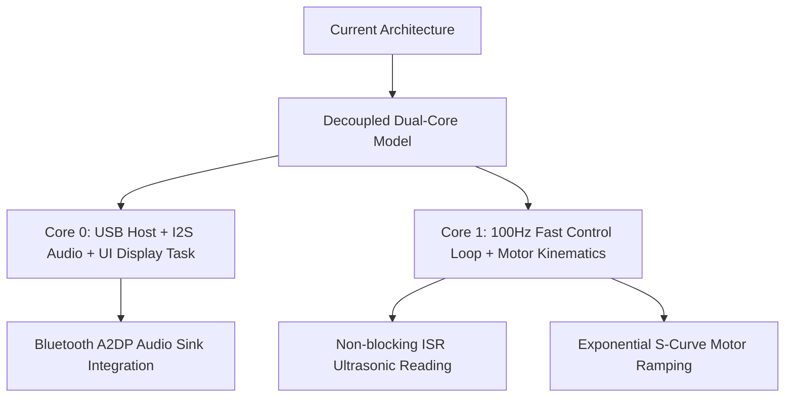

> ⚠ **OUTDATED DOCUMENT (17 Sep 2026):** Is doc mein **purana pin map** hai
> (Spark=GPIO3, Mist=GPIO2, Headlight=GPIO48, I2S DIN=35, UART=36, Buzzer=18,
> BATT_ADC=1, Servos=6/7) — ye sab **ab change ho chuke hain**.
> **Latest verified pins/features ke liye `PROJECT_DETAILS.md` dekho.**
> Ye doc sirf historical reference ke liye rakha gaya hai.


# Xbox 360 Controller Robot Car — Complete Project Analysis, Bug Report & Improvement Roadmap

**Project:** ESP32-S3 Xbox 360 Wireless Robot Car with Dual Display & Car OS  
**MCU:** ESP32-S3 (N16R8) — Dual Core Xtensa LX7 @ 240MHz | 8MB Octal PSRAM | 16MB Quad SPI Flash  
**Framework:** ESP-IDF 6.0.2  
**Date:** September 2026  

---

## 1. System Architecture & Pin Mapping

### A. Architectural Overview
* **Core 0 (USB Host & Audio):**
  * `usb_host` task (Priority 2): Handles USB low-level host events & enumeration.
  * `xbox360` task (Priority 3): Class driver for Redgear Pro / Xbox 360 wireless dongle.
  * `audio` task (Priority 4): I2S audio rendering engine @ 22.05kHz mono for MAX98357A.
* **Core 1 (Car Control, Sensors & Car OS):**
  * `car` task (Priority 2): Differential drive kinematics, 3x HC-SR04 ultrasonic scanning, relay control, WS2812 strip animation, TFT 320x240 DMA frame push, OLED 128x64 mini HUD, and 5 retro arcade games.

### B. Pinout Reference Matrix

| Function | GPIO | Mode / Peripheral | Status / Details |
| :--- | :--- | :--- | :--- |
| **Pan Servo** | `GPIO 4` | LEDC Ch0 (Timer 0, 50Hz) | OK — Right stick X (spark cannon pan) |
| **Tilt Servo** | `GPIO 5` | LEDC Ch1 (Timer 0, 50Hz) | OK — Right stick Y (spark cannon tilt) |
| **Gripper Servo** | `GPIO 6` | LEDC Ch2 (Timer 0, 50Hz) | OK — D-Down toggle/hold |
| **Spoiler Servo** | `GPIO 7` | LEDC Ch3 (Timer 0, 50Hz) | OK — Speed linked / LT air brake |
| **Ultrasonic Left Trig** | `GPIO 12` | GPIO Output | OK |
| **Ultrasonic Left Echo** | `GPIO 9` | GPIO Input | OK |
| **Ultrasonic Front Trig** | `GPIO 38` | GPIO Output | OK |
| **Ultrasonic Front Echo** | `GPIO 10` | GPIO Input | OK |
| **Ultrasonic Right Trig**| `GPIO 8` | GPIO Output | OK |
| **Ultrasonic Right Echo**| `GPIO 11` | GPIO Input | OK |
| **Rear WS2812 Strip** | `GPIO 21` | RMT Channel 0 (DMA) | OK — 2 addressable pixels (tripled) |
| **Front Left WS2812** | `GPIO 17` | RMT Channel 1 | OK — Dedicated front white/indicator |
| **Front Right WS2812**| `GPIO 15` | RMT Channel 2 | OK — Dedicated front white/indicator |
| **I2S BCLK** | `GPIO 39` | I2S0 Master | OK — MAX98357A Bit Clock |
| **I2S LRC / WS** | `GPIO 47` | I2S0 Master | OK — Word Select / Left-Right Clock |
| **I2S DIN** | `GPIO 40` | I2S0 Master | OK — Serial Data Output |
| **Spark Relay** | `GPIO 3` | GPIO Output | OK — Active LOW (400kV module) |
| **Mist Relay** | `GPIO 2` | GPIO Output | OK — Active LOW (Ultrasonic atomizer) |
| **Headlight Relay** | `GPIO 48` | GPIO Output | OK — Active LOW (External headlight) |
| **Backlight Direct LED**| `GPIO 1` | GPIO Output | OK — Active HIGH (Brake light) |
| **UART1 TX (Motors)** | `GPIO 14` | UART1 TX @ 115200 | OK — Serial command `L<l>,R<r>\n` to D1 |
| **OLED SDA** | `GPIO 42` | I2C0 Master (400kHz) | OK — SSD1306 128x64 Display |
| **OLED SCL** | `GPIO 41` | I2C0 Master (400kHz) | OK — SSD1306 128x64 Display |
| **TFT SCLK** | `GPIO 46` | SPI2 Host (40MHz) | OK — 2.8" SPI Display (ILI9341/ST7789) |
| **TFT MOSI** | `GPIO 13` | SPI2 Host (40MHz) | OK |
| **TFT CS** | `GPIO 45` | GPIO Output | OK |
| **TFT DC** | `GPIO 0` | GPIO Output | OK |
| **TFT RST** | `GPIO 16` | GPIO Output | OK |
| **TFT Backlight** | `GPIO 18` | GPIO Output | OK — Active HIGH |

---

## 2. In-Depth Bug Report

### 🔴 Bug 1: Game 5 (Sensor Trainer) Underflow Crash & Glitch
* **Location:** [`main/car_games.c` (Lines 487–495)](file:///c:/Users/aazam/Desktop/xbox360_controller/main/car_games.c#L487-L495)
* **Root Cause:**
  ```c
  static int g5_gap_from_dist(void)
  {
      uint16_t d = g.dist_avg[1];
      if (d == 65535) d = 60;
      if (d > 120) d = 120;
      return 40 + (d - 10) * 200 / 110;
  }
  ```
  When an object or hand comes closer than 10 cm (`d < 10`), the subtraction `(d - 10)` underflows because `d` is an unsigned 16-bit integer (`uint16_t`). For example, when `d = 5`, `(uint16_t)(5 - 10) = 65531`. This produces `gap_x = 119187`.
* **Impact:** The game tries to draw a gate spanning 119,187 pixels across the screen, corrupting the layout and making the target gate disappear.
* **Proposed Fix:**
  ```c
  static int g5_gap_from_dist(void)
  {
      uint16_t d = g.dist_avg[1];
      if (d == 65535) d = 60;
      if (d < 10) d = 10;
      if (d > 120) d = 120;
      return 40 + (d - 10) * 200 / 110;
  }
  ```

---

### 🔴 Bug 2: Game 4 (Memory) Array Bounds Overflow
* **Location:** [`main/car_games.c` (Lines 364–384)](file:///c:/Users/aazam/Desktop/xbox360_controller/main/car_games.c#L364-L384)
* **Root Cause:**
  `s4_seq` is defined with a fixed size of 24:
  ```c
  static uint8_t s4_seq[24];
  static int s4_len;
  ```
  In `g4_new_round()`:
  ```c
  s4_seq[s4_len] = (uint8_t)(esp_random() % 4);
  s4_len++;
  ```
  No boundary check exists. If a skilled player advances past round 24, `s4_seq[24]` writes beyond the allocated buffer into adjacent static variables.
* **Impact:** Memory corruption leading to erratic behavior or task panic.
* **Proposed Fix:**
  ```c
  if (s4_len >= (int)sizeof(s4_seq)) {
      s4_len = sizeof(s4_seq) - 1;
  }
  ```

---

### 🔴 Bug 3: Audio Render Race Condition & SFX Overwrite
* **Location:** [`main/car.c` (Lines 959–1081)](file:///c:/Users/aazam/Desktop/xbox360_controller/main/car.c#L959-L1081)
* **Root Cause:**
  `audio_render()` takes a local snapshot of sound playback states (`loc_shot`, `loc_horn`, etc.) inside a critical section, iterates through 512 samples without the lock, and then copies the snapshot back at the end:
  ```c
  portENTER_CRITICAL(&s_wav_mux);
  s_shot.pos = loc_shot.pos; s_shot.d = loc_shot.d;
  s_horn_wav.pos = loc_horn.pos; s_horn_wav.d = loc_horn.d;
  portEXIT_CRITICAL(&s_wav_mux);
  ```
  If `car_task` (running concurrently on Core 1) calls `play_shot()` or triggers the horn (`wav_play(&s_shot, ...)`) while `audio_task` is processing samples, `s_shot.d` gets set on Core 1 but is immediately overwritten with `loc_shot.d` (which was `NULL`) upon buffer completion!
* **Impact:** Button clicks, menu SFX, laser sounds, and horn triggers are intermittently dropped or clipped.
* **Proposed Fix:**
  Only update `pos` and `d` back into global state if no new sound was assigned during rendering:
  ```c
  portENTER_CRITICAL(&s_wav_mux);
  if (s_shot.d == loc_shot.d) {
      s_shot.pos = loc_shot.pos;
      if (!loc_shot.d) s_shot.d = NULL;
  }
  if (s_horn_wav.d == loc_horn.d) {
      s_horn_wav.pos = loc_horn.pos;
      if (!loc_horn.d) s_horn_wav.d = NULL;
  }
  portEXIT_CRITICAL(&s_wav_mux);
  ```

---

### 🔴 Bug 4: Auto Mode Turning & Escape Steering Clamped to 20%
* **Location:** [`main/car.c` (Lines 1760–1764)](file:///c:/Users/aazam/Desktop/xbox360_controller/main/car.c#L1760-L1764)
* **Root Cause:**
  At the end of `auto_logic()`:
  ```c
  // cap 20% max
  if(spd>20) spd=20;
  if(spd<-20) spd=-20;
  if(st>20) st=20;
  if(st<-20) st=-20;
  ```
  When the auto state machine enters `AST_TURN_L` or `AST_TURN_R` (line 1610), it commands `st = -100` or `st = +100` for an in-place pivot turn. Similarly, in `AST_ESCAPE` phase 1 (line 1669), `st = ±100`.
  The clamp forcefully restricts `st` to `±20`.
* **Impact:** Instead of spinning in place to dodge a wall, the car executes a very wide turning arc and collides with obstacles.
* **Proposed Fix:** Apply the steering clamp only during `AST_CRUISE` and `AST_SLOW`, allowing full differential steering (`st = ±100`) during `AST_TURN_L`, `AST_TURN_R`, `AST_ESCAPE`, and `AST_SEARCH`.

---

### 🟡 Bug 5: Ultrasonic Dynamic Obstacle Blindness (`s_us_front_ok` Timeout)
* **Location:** [`main/car.c` (Lines 300–322 & Line 1868)](file:///c:/Users/aazam/Desktop/xbox360_controller/main/car.c#L300-L322)
* **Root Cause:**
  In `us_read()`:
  ```c
  if (s_us_last && (cm > s_us_last + s_us_last / 4 || cm < s_us_last - s_us_last / 4)) {
      s_us_cnt = 0;
      if (s_us_front_ok && s_us_ok_since && now_ms() - s_us_ok_since > 2000) s_us_front_ok = false;
  }
  ```
  When driving forward towards a wall, the distance decreases dynamically (changing by >25%), resetting `s_us_cnt` to 0. After 2–3 seconds of driving, `s_us_front_ok` expires and turns `false`.
  In `manual_logic()` line 1868:
  ```c
  if (fwd && s_us_front_ok && f != 65535 && f < 15) { cap = 0.0f; }
  ```
  Because `s_us_front_ok` is `false`, automatic obstacle emergency braking in manual mode fails to activate while approaching an obstacle.
* **Impact:** Obstacle brake fails when moving towards obstacles.
* **Proposed Fix:** Continuous valid echoes within 2–400 cm should keep `s_us_front_ok = true` as long as echo pulses are received, without invalidating due to motion delta.

---

### 🟡 Bug 6: Sensor Rolling Average Data Duplication
* **Location:** [`main/car.c` (Lines 1406–1422)](file:///c:/Users/aazam/Desktop/xbox360_controller/main/car.c#L1406-L1422)
* **Root Cause:**
  `us_read()` round-robins one sensor per tick (`seq = (seq + 1) % 3`).
  `dist_update_avg()` pushes all 3 sensor values into `dist_buf` every single tick.
  When Left is sampled, Front and Right values pushed into the buffer are stale duplicates from previous ticks.
* **Impact:** The 3-sample median/average buffer fills with duplicated stale readings, introducing unnecessary lag into distance calculations.
* **Proposed Fix:** Only push `dist_buf[seq][idx]` for the sensor that was actually updated in that specific tick.

---

### 🟡 Bug 7: Reconfiguration of GPIO 14 in `tft_display.c`
* **Location:** [`main/tft_display.c` (Lines 219–222)](file:///c:/Users/aazam/Desktop/xbox360_controller/main/tft_display.c#L219-L222)
* **Root Cause:**
  ```c
  gpio_reset_pin(GPIO_NUM_14);
  gpio_set_direction(GPIO_NUM_14, GPIO_MODE_INPUT);
  gpio_set_pull_mode(GPIO_NUM_14, GPIO_FLOATING);
  ```
  GPIO 14 is assigned to `PIN_UART_TX` (D1 motor slave communication). If `tft_init()` is called again or display re-initializes, it resets the motor communication TX pin to floating input.
* **Impact:** Loss of motor control if display is re-initialized.
* **Proposed Fix:** Remove GPIO 14 cleanup code from `tft_display.c`.

---

### 🟡 Bug 8: Tight 200ms Heartbeat vs Loop Latency
* **Location:** [`main/car.c` (Line 1979)](file:///c:/Users/aazam/Desktop/xbox360_controller/main/car.c#L1979)
* **Root Cause:**
  ```c
  if (now - xbox360_last_data_ms() > 200) {
      g.tgt_l = 0; g.tgt_r = 0; g.cur_l = 0; g.cur_r = 0;
  }
  ```
  The main loop execution time can peak at ~85–95ms when performing OLED I2C flushes, SPI display pushes, and ultrasonic reads. If a single wireless packet experiences minor RF interference, the 200ms cutoff triggers, causing intermittent motor jerks.
* **Impact:** Random motor cut-outs and stutter during driving.
* **Proposed Fix:** Increase safety cutoff threshold to **450–500ms**.

---

### 🟡 Bug 9: `play_shot()` WAV Buffer Underflow Risk
* **Location:** [`main/car.c` (Lines 744–747)](file:///c:/Users/aazam/Desktop/xbox360_controller/main/car.c#L744-L747)
* **Root Cause:**
  ```c
  static void play_shot(const uint8_t *s, const uint8_t *e, uint16_t vol) {
      wav_play(&s_shot, s + 44, (uint32_t)(e - s) - 44, 0, vol);
  }
  ```
  If an invalid pointer or sound asset smaller than 44 bytes is passed, `(e - s) - 44` wraps around to ~4GB (`0xFFFFFF...`), causing illegal memory reads in `audio_render()`.
* **Proposed Fix:** Add guard check `if (e <= s + 44) return;`.

---

### 🟡 Bug 10: Unused LEDC Timers & Lingering Legacy Files
* **LEDC Timers 1 & 2:** Configured in `hw_init()` without attached channels (legacy motor & buzzer code).
* **Uncompiled Legacy Files:** `display_driver.c`, `display_driver.h`, `tft_game.c`, `ui_dashboard.c`, `sensors_adv.h` are not part of `CMakeLists.txt`.
* **Root Directory Clutter:** 70+ unused `.txt` log files from previous sessions.

---

## 3. Improvement & Feature Roadmap



### 1. Dual-Core Task Decoupling
* **Proposal:** Separate display rendering (`os_draw_tft` and `os_draw_oled`) into a dedicated `ui_task` (pinned to Core 0 or low priority Core 1).
* **Benefit:** `car_task` loop frequency increases from ~15Hz to a locked **100Hz (10ms)**, providing instant controller responsiveness and smoother motor ramping.

### 2. Interrupt-Driven (ISR) Ultrasonic Sensing
* **Proposal:** Use GPIO edge interrupts (`GPIO_INTR_ANYEDGE`) and an ESP timer timestamp instead of blocking `while()` loops with `esp_rom_delay_us()`.
* **Benefit:** Eliminates CPU spin-waiting, saving ~12ms of CPU time per sensor reading and removing measurement jitter caused by task switching.

### 3. Bluetooth A2DP Audio Sink (PC / Smartphone Music)
* **Proposal:** Integrate ESP-IDF Bluetooth A2DP Sink to route decoded Bluetooth audio directly to the MAX98357A I2S amplifier.
* **Benefit:** Allows the car to double as a wireless high-power Bluetooth speaker while driving.

### 4. Battery Voltage Monitoring via Dedicated ADC Pin
* **Proposal:** Re-route the backlight to a spare digital pin and connect a 3S LiPo voltage divider (330kΩ / 100kΩ) to GPIO 1 (ADC1_CH0).
* **Benefit:** Live voltage display (e.g. `11.8V 3S LiPo`) on both TFT dashboard and OLED HUD with automatic low-voltage safety alarm.

### 5. Exponential S-Curve Motor Acceleration
* **Proposal:** Replace linear ramping with S-curve acceleration smoothing.
* **Benefit:** Eliminates sudden tire slippage and reduces peak inrush current on the motor drivers.
