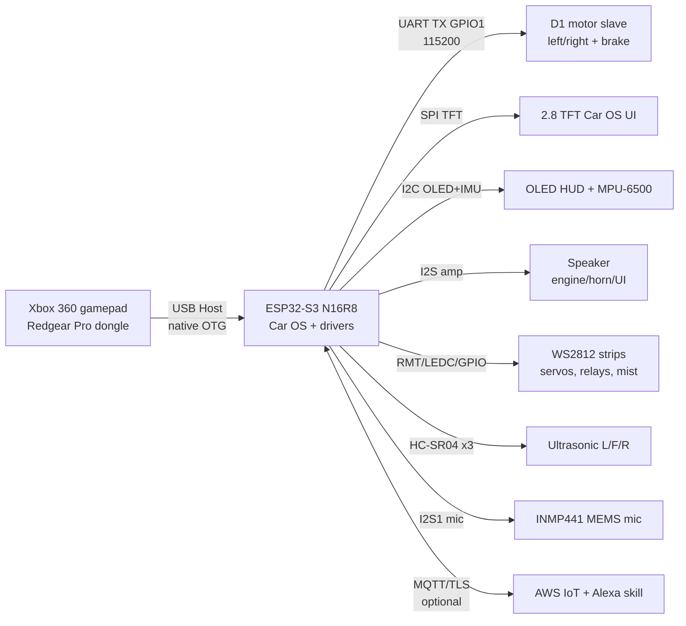

# 🚗 xbox360_controller — ESP32-S3 Robot Car + Car OS


Xbox 360 wireless controller (Redgear Pro dongle) se chalne wala robot car,
jis par custom **"Car OS" dashboard** chalta hai (TFT + OLED), sath me
WiFi / AWS IoT (Alexa) voice-control bridge.

> 🔐 **Security:** is repo me koi WiFi password, private key ya device
> certificate **nahi** hai. Ye sab NVS provisioning se device me dalte hain
> ([Provisioning](#-provisioning-wifi--alexa--nvs)). `*.pem`, `nvs_pems.csv`,
> `nvs_certs_only.csv` sab `.gitignore` me hain.

---

## 📖 Contents

- [System overview](#-system-overview)
- [Features](#-features)
- [Pin map (code se — single source of truth)](#-pin-map-code-se--single-source-of-truth)
- [Wiring diagram](#-wiring-diagram)
- [Project structure](#-project-structure)
- [Build & flash](#-build--flash-esp-idf-v60)
- [Provisioning](#-provisioning-wifi--alexa--nvs)
- [Releases](#-releases)
- [Troubleshooting](#-troubleshooting)
- [Docs](#-docs)

---

## 🖥️ System overview



**Boot flow** (`main/main.c` → `app_main()` — 4 FreeRTOS tasks):

| Task | Core | Prio | Kaam |
|---|---|---|---|
| `usb_host` | 0 | 2 | USB Host library events |
| `xbox360` | 0 | 3 | Gamepad driver (`main/xbox360.c`) |
| `car` | 1 | 2 | Car control + Car OS + HUD (`main/car.c`) |
| `alexa` | 1 | 1 | WiFi + MQTT/TLS bridge (`main/alexa_bridge.c`, `main/net_wifi.c`) |

USB-OTG port **sirf gamepad** ke liye hai — console `UART0` (board USB-UART
bridge) par hai. Motors real brake support ke sath UART slave se chalte hain;
cloud kabhi direct motor command nahi bhejta (safety gateway).

---

## ✨ Features

**Drive**
- Dual-stick drive, triggers, gear 1–5 speed caps (Car OS Settings se, NVS persist),
  RB turbo bypass (100%), real brake, crawl/auto modes (`MODE_MANUAL/CRAWL/AUTO`)

**Car OS (TFT 320×240)**
- Drive HUD / cockpit (`ui_drive_cockpit.c`), Analytics, Settings, Games Hub,
  Diagnostics, standby clock (IST), Notification Center (`notif.c`), toast overlays
- Mini HUD mirror + `DIAG>SENS` live VU meter (OLED)

**Games**
- Neon Convoy (`cargame_neon_convoy.c`), Neon Serpent (`cargame_neon_serpent.c`),
  TFT game framework (`tft_game.c`, `car_games.c`)

**Sensors & safety**
- 3× HC-SR04 (L/F/R distance), MPU-6500 IMU → Motion Radar (`ui_motion_radar.c`),
  impact/landing/freefall effects, stuck alert, gear-limit sounds

**Sound & lights**
- I2S amp: engine loop, horn, gear shift, UI clicks, chimes (SPIFFS `storage` partition,
  `spiffs/snd/*.raw`, generated by `tools/gen_sounds.py`)
- Rear WS2812 (2 px → 6 LEDs) + under-car 12 LEDs **same GPIO6 daisy-chain**,
  front L/R WS2812, roof police WS2812 (music-beat mode mic se), relay headlight /
  rear / mist, pan-tilt servos (spark cannon aim)

**Mic (M1/M2/M3)** — `mic_in.c`
- M1: 64 KB PSRAM ring, RMS envelope → roof MUSIC MODE + VU meter
- M2: double-clap (parked only) → headlight toggle
- M3: 3 s listen buffer (foundation, no processing yet)

**Cloud (optional)** — `alexa_bridge.c`, `components/voice_ai`
- MQTT/TLS Device Shadow, command TTL, offline mode jab WiFi na ho
- Empty broker = bridge disabled (zero traffic, sleeping task)

---

## 📌 Pin map (code se — single source of truth)

Source: `main/car.c` (PIN_*), `main/tft_display.h`, `main/mic_in.h`, `main/roof_light.h`.

### TFT display (SPI2)

| TFT | GPIO | Note |
|---|---|---|
| SCLK | **21** | (46 → headlight relay ko gaya) |
| MOSI | **38** | |
| CS | **45** | ⚠️ strapping pin — boot par pull-up rakho |
| DC | **0** | ⚠️ strapping pin — boot par floating/externally pulled |
| RST | **2** | |
| BL | **-1** | 3.3V direct, PWM off (`TFT_PIN_BL = -1`) |

### Motion, display bus, audio (I2C / I2S)

| Function | GPIO | Note |
|---|---|---|
| OLED SDA / IMU SDA | **42** | Shared bus, OLED addr `0x3C` |
| OLED SCL / IMU SCL | **41** | MPU-6500 same bus |
| Speaker BCLK (MAX98357A) | **39** | I2S0 TX |
| Speaker LRC | **47** | |
| Speaker DIN | **40** | (35 octal-PSRAM pin hai N16R8 par — avoid) |
| Mic SCK (INMP441) | **13** | I2S1 RX, 16 kHz mono |
| Mic WS | **14** | (old backlight relay hata kar repurposed) |
| Mic SD | **48** | |

### Drive, distance, servos

| Function | GPIO | Note |
|---|---|---|
| Motor UART TX → D1 RX | **1** | 115200 (battery ADC removed, yehi pin) |
| Servo PAN | **4** | LEDC ch0 |
| Servo TILT | **5** | LEDC ch1 |
| US TRIG Left | **12** | |
| US TRIG Front | **7** | |
| US TRIG Right | **8** | |
| US ECHO Left | **9** | Input |
| US ECHO Front | **10** | Input |
| US ECHO Right | **11** | Input |

> Rear ultrasonic removed (pins freed). Gripper/spoiler servos removed (ch2/ch3
> no-op). `PIN_BATT_ADC` / buzzer removed — horn I2S amp karta hai.

### Lights, relays, mist

| Function | GPIO | Type | Note |
|---|---|---|---|
| Rear WS2812 + under-car (daisy-chain) | **6** | RMT strip | 2 px rear (→6 LEDs) + 12 under-car, rear DOUT → under DIN |
| Front Left WS2812 | **17** | RMT strip | 1 px |
| Front Right WS2812 | **15** | RMT strip | 1 px |
| Roof police WS2812 | **18** | RMT strip | 1 IC = 3 LEDs same colour |
| Headlight relay | **46** | Active-LOW | ⚠️ strapping pin |
| Rear/spoiler light relay | **3** | Active-LOW | ⚠️ strapping pin |
| Mist maker relay | **16** | Active-LOW | |

⚠️ **Boot/strapping warning:** GPIO `0`, `3`, `45`, `46` strapping pins hain.
In par boot-time par sahi pull-up/down chahiye, warna board flash/boot mode me
phas sakta hai. Relays active-LOW hain — `car.c` boot par safe levels set karta
hai (rear ON, mist/headlight OFF, TRIG idle LOW). TFT DC=0 aur CS=45 ke sath
external wiring me pull resistors ka dhyan rakho.

**Free / do-not-touch:** `19/20` (USB D-/D+ gamepad), `43/44` (console UART),
`26–37` (flash/PSRAM), `22–25` module par exist nahi karte.

---

## 🔌 Wiring diagram

```mermaid
flowchart TB
    subgraph S3[ESP32-S3 N16R8]
        OTGB[USB-OTG D-/D+<br/>19/20]
        U0[UART0 console<br/>43/44]
        SPI[SPI2 TFT<br/>21/38/45/0/2]
        I2C[I2C bus<br/>42/41]
        I2SA[I2S0 speaker<br/>39/47/40]
        I2SM[I2S1 mic<br/>13/14/48]
        MOT[UART TX 115200<br/>GPIO1]
        SRV[LEDC 4/5]
        US[GPIO 7/8/12<br/>+ 9/10/11]
        L6[GPIO6 strip]
        L1715[GPIO17/15]
        R18[GPIO18]
        RL[GPIO46/3/16]
    end
    OTGB --> DONGLE[Xbox 360 dongle]
    U0 --> PC[PC monitor]
    SPI --> TFTLCD[2.8 TFT]
    I2C --> OLED96[OLED 0x3C]
    I2C --> MPU[MPU-6500]
    I2SA --> AMP[MAX98357A + speaker]
    I2SM --> MICM[INMP441 mic]
    MOT --> D1SLAVE[D1 motor driver]
    SRV --> SERVO[Pan/Tilt servos]
    US --> HCSR[HC-SR04 x3]
    L6 --> REAR[Rear 2px + under 12]
    L1715 --> FRONT[Front L/R]
    R18 --> ROOF[Roof police]
    RL --> RELAYS[Headlight/Rear/Mist]
```



Power: WS2812 strips + servos + mist ko alag 5V supply do (S3 5V pin se heavy
load mat lo). Sab grounds common rakho. Relay boards active-LOW hain.

---

## 📁 Project structure

```
CMakeLists.txt          # IDF project (target esp32s3, 16MB flash)
partitions.csv          # nvs / otadata / phy / factory 6M / storage SPIFFS 9.8M
sdkconfig.defaults      # target + PSRAM + partition defaults (no secrets)
main/                   # firmware: car.c, Car OS (os_*), drivers, xbox360.c,
                        #   net_wifi.c, alexa_bridge.c (+ alexa_config.h, NVS-based)
components/voice_ai/    # voice/AI component (offline-capable)
spiffs/                 # storage partition assets (snd/*.raw, img/*)
tools/*.py              # asset generators (cars, sounds, topdown, cockpit)
cloud/alexa/            # Lambda skill (Node), IoT policy docs, NVS provision script
build/                  # (ignored) IDF build output
managed_components/     # (ignored) IDF component manager deps
```

Key sources: `main/car.c` (control + pin map) · `main/car_global.h` (shared state) ·
`main/os_screens_tft.c` (Car OS) · `main/xbox360.c` (gamepad) ·
`main/alexa_bridge.c` + `main/net_wifi.c` (cloud) · `main/mic_in.c` (mic) ·
`main/roof_light.c` (police light) · `main/display_driver.c` + `tft_display.c` /
`os_oled.c` (screens).

---

## 🚀 Build & flash (ESP-IDF v6.0)

```bash
source ~/esp/esp-idf-v6.0.2/export.sh   # v6.0 toolchain (project needs idf>=6.0)
idf.py build
idf.py -p /dev/ttyUSB0 flash monitor
```

Flash layout (16 MB, `build/flasher_args.json` source of truth):

| Offset | File |
|---|---|
| 0x0 | `build/bootloader/bootloader.bin` |
| 0x8000 | `build/partition_table/partition-table.bin` |
| 0xf000 | `build/ota_data_initial.bin` |
| 0x20000 | `build/xbox360_controller.bin` |
| 0x620000 | `build/storage.bin` (SPIFFS assets) |

Manual:

```bash
python -m esptool --chip esp32s3 -b 460800 --before default-reset --after hard-reset \
  write-flash --flash-mode dio --flash-size 16MB --flash-freq 80m \
  0x0 build/bootloader/bootloader.bin \
  0x8000 build/partition_table/partition-table.bin \
  0xf000 build/ota_data_initial.bin \
  0x20000 build/xbox360_controller.bin \
  0x620000 build/storage.bin
```

> 📦 **Ready firmware:** GitHub **Releases** me `firmware-vX.Y.Z.zip`
> (5 `.bin` + `flash.sh`/`flash.ps1`) — build ki zaroorat nahi.

---

## 🔐 Provisioning (WiFi + Alexa — NVS)

Firmware me koi default password/key nahi. Pehli baar NVS me dalo:

**WiFi** — namespace `net`: `wifi_ssid`, `wifi_pass`

**Alexa / AWS IoT** — namespace `alexa`: `broker`
(e.g. `mqtts://<endpoint>.iot.<region>.amazonaws.com:8883`), `user`, `thing`,
`profile` + blobs `ca`/`cert`/`key` (PEM):

```bash
python3 cloud/alexa/write_pems_nvs.py \
  --port /dev/ttyUSB0 \
  --cert cloud/alexa/device_cert.pem \
  --key cloud/alexa/private_key.pem
```

Alexa skill setup: **`cloud/alexa/README_ALEXA_SETUP.md`**

---

## 📦 Releases

Har release me `firmware-<version>.zip` + `flasher_args.json` hota hai.
Flash ke baad [Provisioning](#-provisioning-wifi--alexa--nvs) zaroor karo,
warna WiFi/Alexa disabled rahega aur car offline mode me chalegi
(gamepad + Car OS kaam karega).

---

## 🛟 Troubleshooting

- **Monitor garbage / no boot:** `idf.py -p /dev/ttyUSB0 monitor` @115200;
  USB-UART bridge wali port use karo (OTG gamepad ke liye).
  Strapping (`0/3/45/46`) wiring check karo.
- **WiFi nahi:** NVS `net` keys check; `net_wifi` tag me `using SSID ...` dekho.
- **Alexa silent:** `broker` empty = disabled (by design). NVS `alexa` keys +
  `ca/cert/key` blobs check karo.
- **Sound/img missing:** `storage.bin` 0x620000 par flash hua? `spiffs/` se
  `idf.py build` dobara banata hai.
- **Gamepad nahi:** dongle OTG port par, logs me `xbox360` tag dekho.
- **Mic silent:** `DIAG>SENS` VU meter dekho; SCK=13/WS=14/SD=48 wiring check.

---

## 📄 Docs & license

`PROJECT_DETAILS.md` (full reference) · `CAR_OS_UI_GUIDE_UPDATED.md` ·
`CODE_REVIEW_2026-09-17.md` · `PROJECT_ANALYSIS_AND_BUGS.md` ·
`SESSION_SUMMARY.md` · `cloud/alexa/README_ALEXA_SETUP.md`

SPDX headers ke mutabiq (Apache-2.0) jahan mentioned hai. Baqi code as-is —
pehle test bench par chalao.
